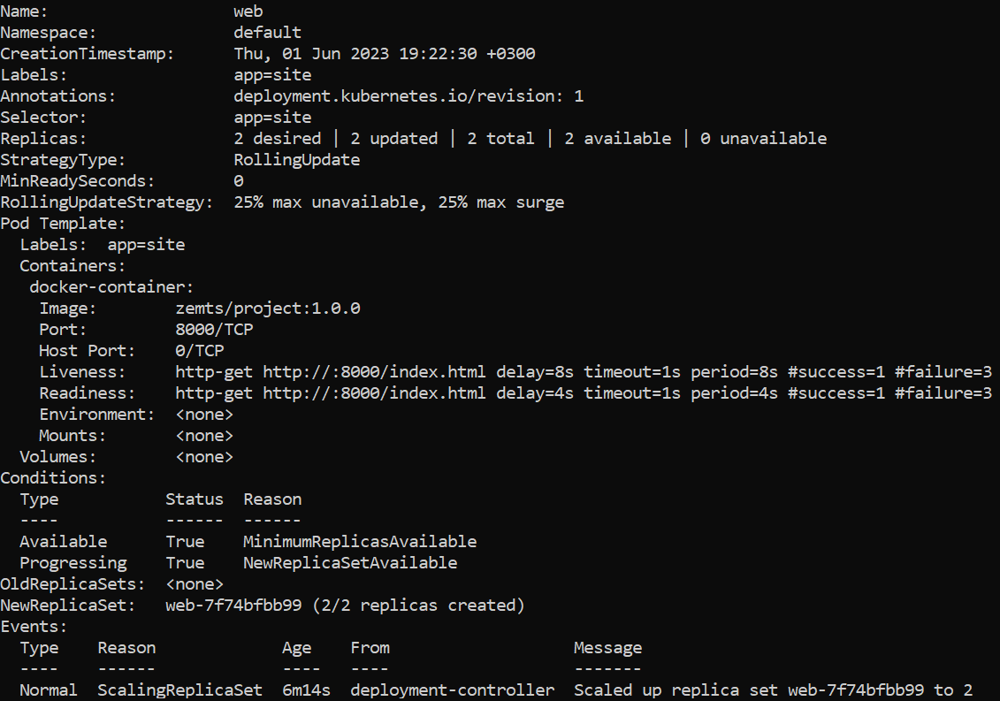

Создадим файл index.html
```
<!DOCTYPE html>
<html>
<head>
  <title>Hello World</title>
</head>
<body>
  <h1>Hello, World!</h1>
</body>
</html>
```
Создадим файл Docerfile
```
# Базовый image
FROM python:3.10-alpine

# Переменные, используемые для создания окружения, в котором запустится приложение
ARG USER=app 
ARG UID=1001
ARG GID=1001

# Создание пользователя операционной системы и его домашнего каталога
RUN addgroup -g ${GID} -S ${USER} \
   && adduser -u ${UID} -S ${USER} -G ${USER} \
   && mkdir -p /app \
   && chown -R ${USER}:${USER} /app
USER ${USER}

# Переход в каталог /app
WORKDIR /app

# Копирование файла hello.html в домашний каталог
COPY --chown=$USER:$USER hello.html /app

# Команда запуска web-сервера
CMD ["python", "-m", "http.server", "8000"]
```
Запустим докер
```
sudo service docker start
```
Авторизуемся в Docker registry
```
docker login -u zemts
```
Соберём Docker image
```
docker build -t zemts/project:1.0.0 --network host .
```
Посмотрим сделанный образ
```
docker image ls
```
Запустим Docker container и помотрим приложение по адресу http://127.0.0.1:8000/index.html

```
docker run -ti --rm -p 8000:8000 --name project --network host zemts/project:1.0.0
```
Выложим на Docker Hub
```
docker push zemts/project:1.0.0
```

Переопределим путь к kubeconfig и запустим minikube
```
export KUBECONFIG=$HOME/.kube/minikube
```
```
minikube start --embed-certs
```

Создадим файл deployment_zemts.yaml
```
apiVersion: apps/v1
kind: Deployment
metadata:
  name: web
  labels:
    app: site
spec:
  replicas: 2
  selector:
    matchLabels:
      app: site
  template:
    metadata:
      labels:
        app: site
    spec:
      containers:
      - name: docker-container
        image: zemts/project:1.0.0
        ports:
        - containerPort: 8000
        readinessProbe:
          httpGet:
            path: /index.html
            port: 8000
          initialDelaySeconds: 4
          periodSeconds: 4
        livenessProbe:
          httpGet:
            path: /index.html
            port: 8000
          initialDelaySeconds: 8
          periodSeconds: 8
```

Применим Deployment manifest

```
kubectl apply --filename deployment_zemts.yaml --namespace default
```

Посмотрим информацию о Deployment manifest

```
kubectl describe deployment web --namespace default
```

Посмотрим количество Pod в Deployment, проверим готоность к работе

```
kubectl get deployments --namespace default
```

Проверим работоспособность приложения, помотрим приложение по адресу http://127.0.0.1:8080/index.html

```
kubectl port-forward --address 0.0.0.0 deployment/web 8080:8000
```

Результат команды kubectl describe deployment web


